# Project backgroud


This project involves deploying a WordPress website using a 3-Tier Traditional Architecture on AWS. The architecture ensures scalability, reliability, and security for hosting the website. Key components include:

- Network Setup: Configuring a VPC with 2 public subnets and 4 private subnets. An Internet Gateway (IGW) is used for external connectivity, while 2 NAT Gateways in public subnets provide internet access for resources in private subnets.
- Load Balancing: An Application Load Balancer (ALB) distributes incoming traffic to the instances.
- Compute Layer: Two EC2 instances are deployed in private subnets for hosting the WordPress application.
- Database Layer: An Amazon RDS instance is configured in the private subnets.
- Routing and Security: Route tables and security groups are set up for controlling traffic flow and ensuring resource protection.

### Diagram
the architectural diagram for the project:

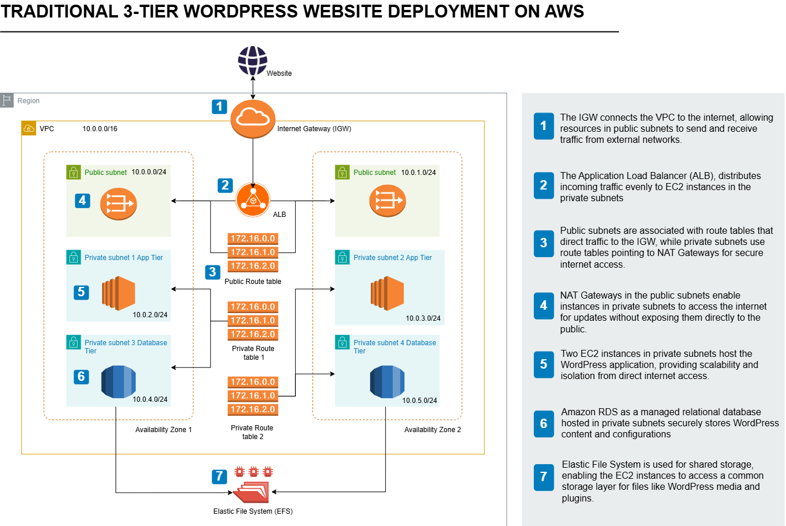

### AWS services related

Amazon VPC: 
Internet Gateway (IGW): 
NAT Gateway: 
Application Load Balancer (ALB): 
Amazon EC2:
Amazon RDS: 
IAM Roles & Policies:
Route Tables:
Security Groups:

### Steps

1. Networking Setup
2. Create a NAT Gateway and Security Groups
3. MySQL database and EFS
4. Setting up EC2 instances and Application Load Balancer
5. Conclusion


# Setp1 Networking Setup

### Create a New VPC

- Name Tag: `My3TierVPC`
- IPv4 CIDR Block: `10.0.0.0/16`

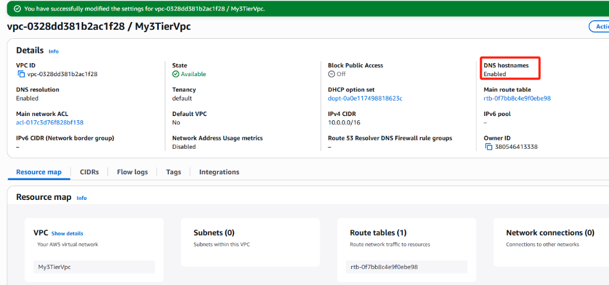

### Create an Internet Gateway

- Create the IGW
- Attach IGW to the VPC

### Create Subnets

- 2 Public Subnets (NAT Gateways with 2 Availability Zones)
- 4 Private Subnets (2 Private Subnets for App Tier and 2 Private Subnets for the Database Tier)

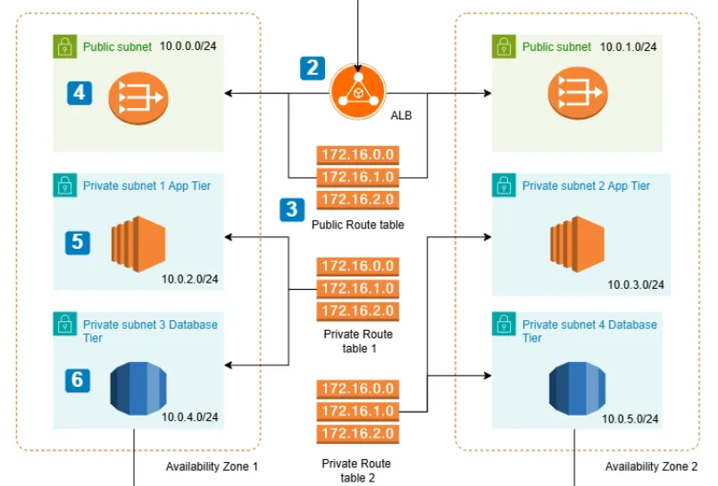

all subnets created

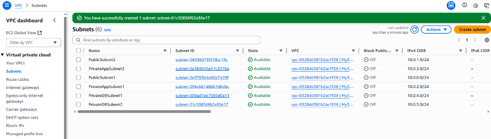


### Create Route Tables and Associate with Subnets

- Allow public subnets to access the internet (via IGW).
- Keep private subnets internal (using a NAT gateway later).

the whole picture of the route tables

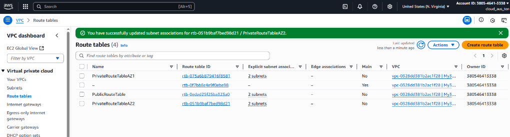


# Setp2 Create a NAT Gateway and Security Groups

In AWS, subnets can either be public (can access the internet) or private (cannot access the internet directly). But sometimes, private subnets still need internet access.

This is where NAT (Network Address Translation) Gateways come in! NAT Gateways allow instances in private subnets to reach the internet without exposing them to inbound traffic.

To set NAT Gateways 

### Allocate Two Elastic IPs:

Click on Allocate Elastic IP address.
having 2 Elastic IP address created. 

### Create NAT Gateways
Navigate to NAT Gateways:
In the VPC Dashboard, select NAT Gateways.

- Create a NAT Gateway for PublicSubnet1:
Click Create NAT Gateway.
Name Tag: `NATGateway1`.
Subnet: Select `PublicSubnet1` (e.g., `10.0.0.0/24`  in AZ1).
Elastic IP Allocation: Select one of the allocated Elastic IPs.

- Create a NAT Gateway for PublicSubnet2:
Repeat the steps above, but:
Name Tag: `NATGateway2`.
Subnet: Select `PublicSubnet2` (e.g., `10.0.1.0/24` in AZ2).
Elastic IP Allocation: Use the second Elastic IP.

### Add NAT Gateways to Route Tables

1. Navigate to Route Tables:
Go to the Route Tables section in the VPC Dashboard.

2. Update PrivateRouteTableAZ1:
Select `PrivateRouteTableAZ1`.
Go to the Routes tab and click Edit Routes.
Add a new route:
Destination: `0.0.0.0/0`.
Target: Select `NATGateway1`.
Click Save Changes.

3. Update PrivateRouteTableAZ2:
Repeat the steps above for `PrivateRouteTableAZ2`

### Create Security Groups

Because we're building a 3-tier architecture, we’ll set up different Security Groups for each layer:
- Application Load Balancer (ALB)
- Web Servers
- Database (RDS or MySQL instance)
- Elastic File System (EFS)
- SSH Access

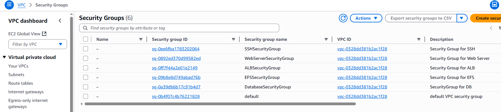


# Setp3 MySQL database and EFS

1. Create a DB Subnet Group.
2. Create the MySQL Database.
3. Create an EFS.

### Mysql setting

- Choose Engine Options:
Engine Type: MySQL
Version: Select the latest supported version (e.g., `8.0.39`).
- Templates:
In the Templates section, choose Free Tier
- Specify Settings:
DB instance Identifier: `MyMySQLDatabase`.
Master Username: Set a username (e.g., `admin`).
For the credentials management, choose the Self managed option.
Master Password: Set a strong password and confirm.
- Connectivity:
VPC: Select `My3TierVPC`.
Subnet Group: Choose `MyDBSubnetGroup`.
Public Access: Set to `No`.
VPC Security Group: Select `DatabaseSecurityGroup`.
For the Availability zone preference, choose any of the zone: 
- Database Authentication:Use password authentication (or additional authentication methods like IAM if needed).
- Database Options: Database Name: Set a name (e.g., `mydb`).
DB Parameter Group: Use the default or a custom parameter group.
Option Group: Use the default or a custom option group.

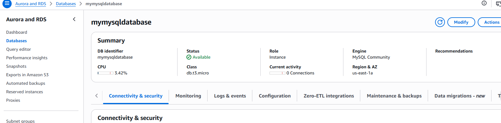


### EFS setting

- Configure Network Access:
VPC: Select `My3TierVPC`.
Select the created `My3TierVPC` from the dropdown.
Add Access Points:
Select the private subnets (e.g., `10.0.2.0/24`, `10.0.3.0/24` for the app tier).Assign the `EFSSecurityGroup` to allow NFS traffic.

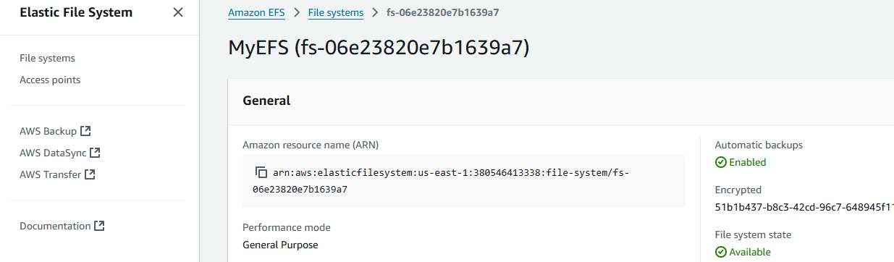


# Setp4 Setting up EC2 instances and Application Load Balancer

1. Launch and Configure Setup EC2 instance
2. Configure Webserver and Install WordPress
3. Launch Two EC2 Instances in Private Subnets
4. Create an Application Load Balancer (ALB)

### Launch and Configure Setup EC2 Instance
- Network Settings:
VPC: Select `My3TierVPC`.
Subnet: Choose `Public Subnet 1`.
Auto-assign Public IP: Enabled.
Security Groups: Add the following:
'SSH-SecurityGroup`
`Webserver-SecurityGroup`
'ALB-SecurityGroup`

### Configure Webserver and Install WordPress

```vim
#!/bin/bash
exec > /var/log/manual-test.log 2>&1
set -x

# Update system
yum update -y

# Install Apache web server, mod_ssl, and related tools
sudo yum install -y httpd httpd-tools mod_ssl

# Enable and start Apache service
sudo systemctl enable httpd
sudo systemctl start httpd

# Install PHP and necessary extensions
sudo yum install -y php php-common php-pear php-cli php-{cgi,curl,mbstring,gd,mysqlnd,gettext,json,xml,fpm,intl,zip}

# Install MySQL
sudo wget https://dev.mysql.com/get/mysql80-community-release-el9-1.noarch.rpm
sudo dnf install mysql80-community-release-el9-1.noarch.rpm -y
sudo rpm --import https://repo.mysql.com/RPM-GPG-KEY-mysql-2023
sudo dnf install mysql-community-server -y

# Enable and start MySQL service
sudo systemctl enable mysqld
sudo systemctl start mysqld

# Mount EFS to /var/www/html directory (Replace with your EFS mount command)
echo "fs-0a2e9aba858e7790f.efs.us-east-1.amazonaws.com:/ /var/www/html nfs4 nfsvers=4.1,rsize=1048576,wsize=1048576,hard,timeo=600,retrans=2 0 0" >> /etc/fstab
mount -a

# Restart Apache web server to apply changes
sudo service httpd restart
```

Update database settings (DB_NAME, DB_USER, DB_PASSWORD, DB_HOST). in _wp-config.php_

- Complete WordPress Installation

```http://<Public-IP-Address>```

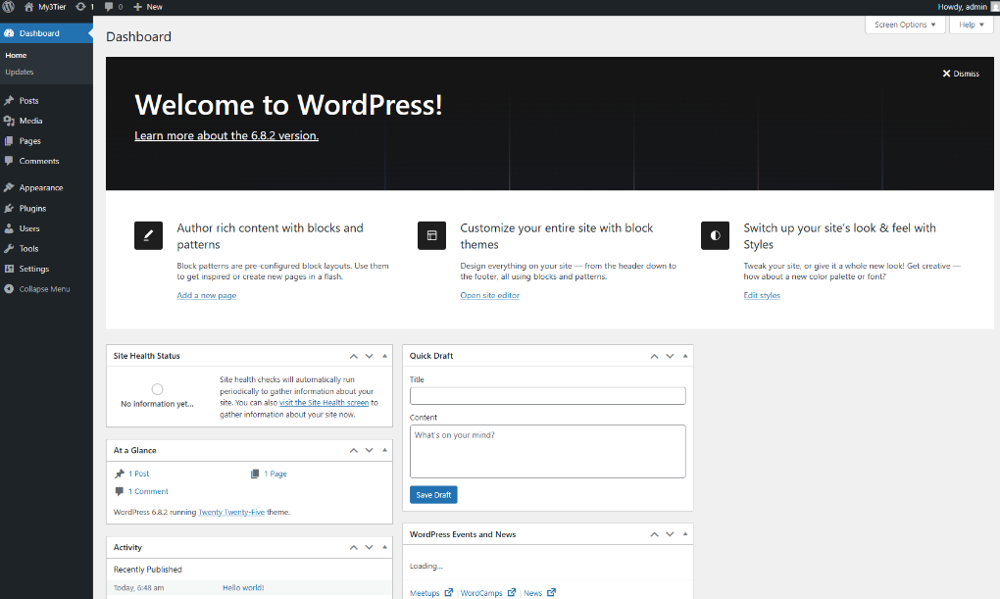


### Launch Two EC2 Instances in Private Subnets

- Launch EC2 Instance:

 Name the instance- `ApplicationServer1`
Choose the Amazon Linux (or Amazon Linux 2) AMI for your EC2 instances.Choose t2.micro (or an appropriate instance type based on your requirement).
Choose the existing key pair.
For Network, select the VPC and ensure the instance is placed in Private Subnet 1.
Under Security Group, create or select a security group:

In the Advanced Details section of the EC2 Launch Wizard, add the following User Data script for automation. The scripts are the same as the above part.

- Repeat the similar process for one more EC2 instance. Instance name: ApplicationServer2

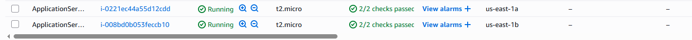

### Create an Application Load Balancer (ALB)


To distribute the incoming website requests to our created two EC2 instances in different availability zones, we will use an Application Load Balancer (ALB).

#### ALB settings:

- Choose Application Load Balancer.
- Provide a name for the ALB: `MyALB`
- Scheme: Select Internet-facing
- Under the Networking mapping, select the created VPC. Choose the availability zones us-east-1a and us-east-1b . Select the PublicSubnet1 and PublicSubnet2 under the subnets dropdown. 
- Listeners: Add HTTP (port 80). Under the target group, click on Create a Target group.
- Choose Instances as the target type.
- Give the target group name: `MyAppServers`
- Select the created VPC. Click on Next.
- Under the Register targets, choose the instances- `ApplicationServer1` and `ApplicationServer2`.
- Click on Include as pending below. Click on create target group.
Navigate back to the ALB creation page and select the newly created target group under the Listeners section.

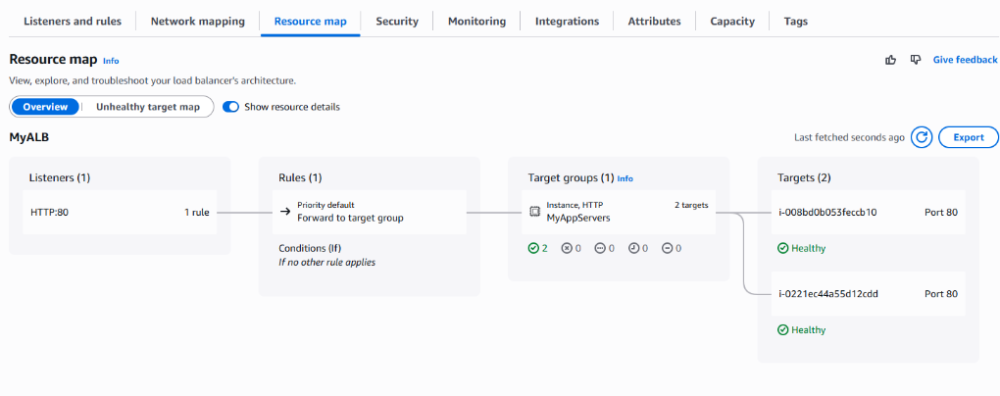

------------------------------------------------------

1. Check the Website Using ALB Link
After the ALB is successfully set up, AWS will provide a DNS name for the ALB. Open this URL in a browser. If the setup is correct, you should see the WordPress page.

2. Login to WordPress Admin:
Go to `http://<ALB-DNS-name>/wp-admin` to access the WordPress admin panel.

3. Change Site URL:
Go to Settings > General in the WordPress admin dashboard.
Change the WordPress Address (URL) and Site Address (URL) to the ALB DNS name:

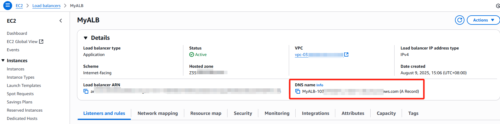

Once the setup is complete and you’ve confirmed that the WordPress site is running properly, you can terminate the Setup EC2 instance (`Webserver-Instance`).


# Conclusion

The final result:
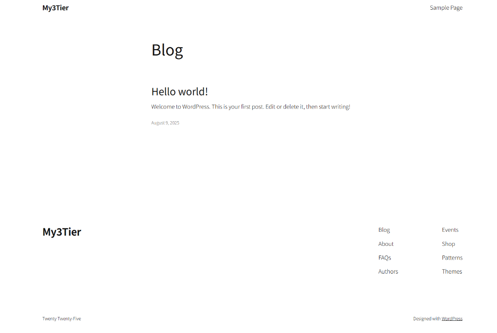

This project demonstrated how to design and deploy a 3-Tier WordPress Website on AWS, emphasizing scalability, security, and high availability. You manually configured core resources across the networking, compute, and database layers to support a production-ready environment.


